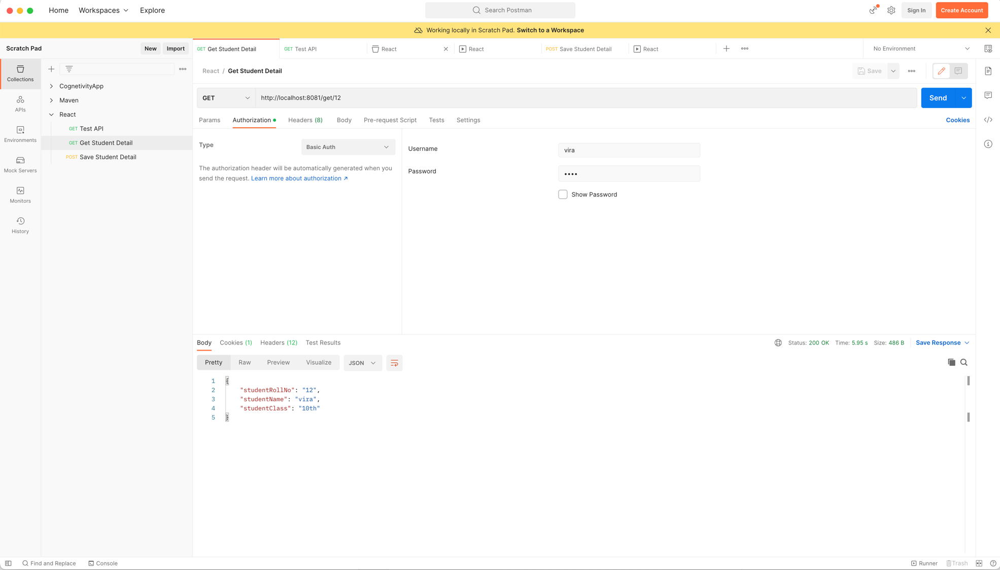
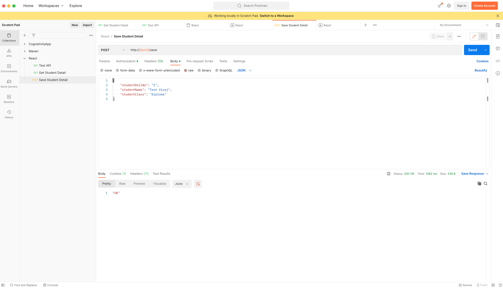
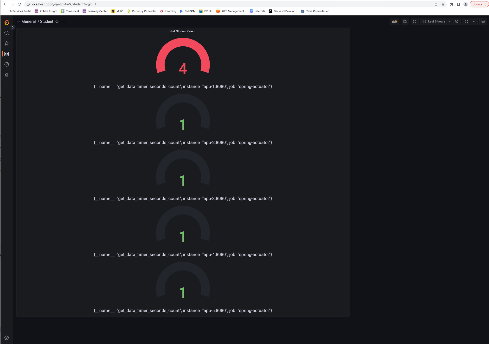

# Welcome to React

This project is a benchmark for most of the best practices one should follow when active development is in progress. Few
things are more like an experiment with new features and checking compatibility.

## Usage

- APIs
    - Get Student -   
      
    - Save Student
      

- Grafana Metrics
    - Business Metrics
      
- Zipkin Tracing

-------
Note - Make sure Authorization fields are not empty.